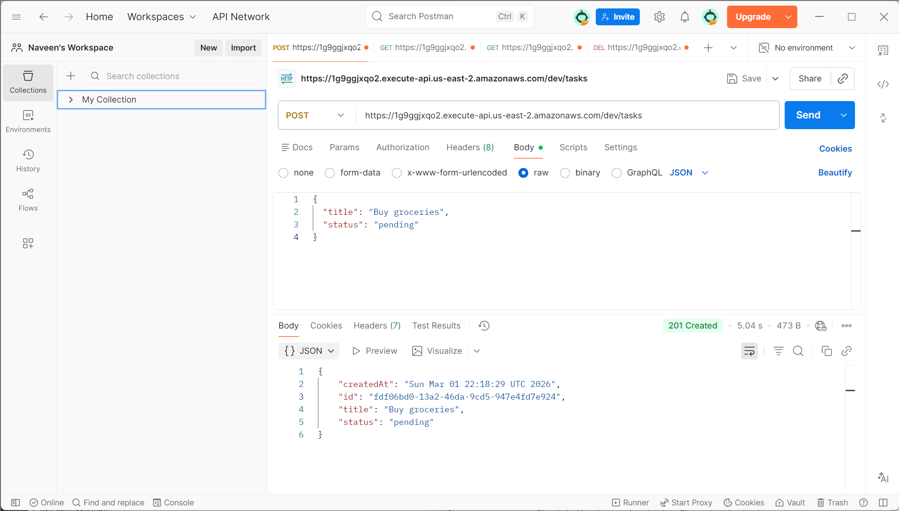
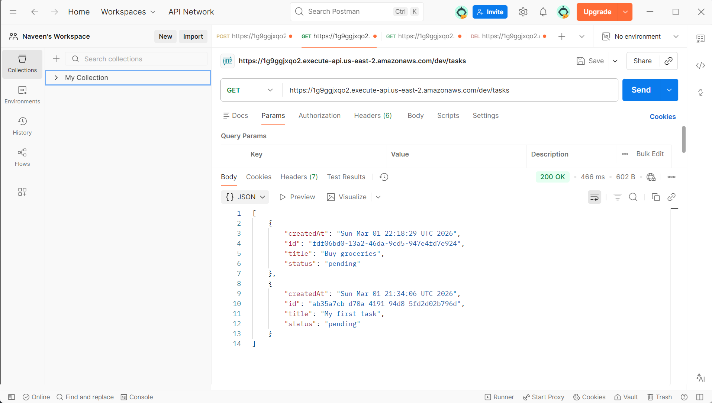
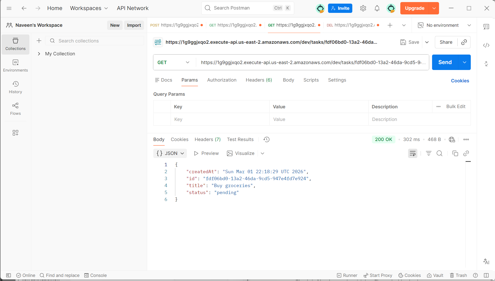
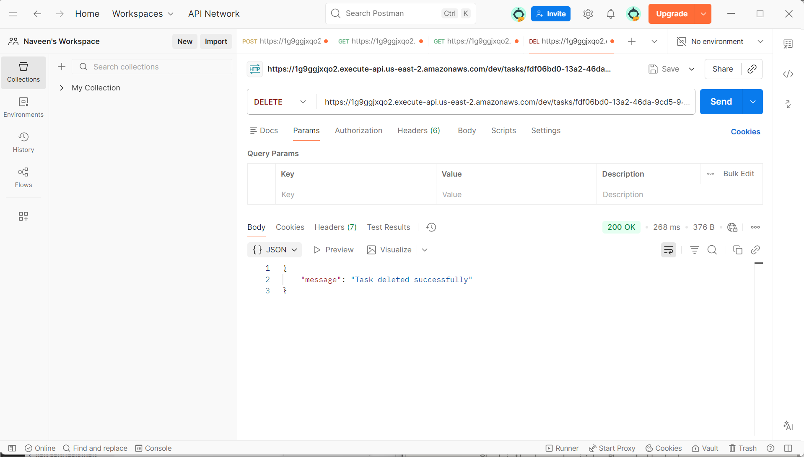

# Task Manager REST API

Serverless REST API built with AWS Lambda, API Gateway, and DynamoDB — handling full CRUD operations with a NoSQL backend on the AWS free tier.

> **Note:** This is a backend REST API — not a website. Use Postman or any REST client to test the endpoints. Download Postman free at https://postman.com/downloads

## Live API URL
https://1g9ggjxqo2.execute-api.us-east-2.amazonaws.com/dev

## Architecture
Postman → API Gateway → AWS Lambda (Java 21) → DynamoDB

## Tech Stack
- Java 21 runtime on AWS Lambda
- AWS API Gateway (REST API)
- AWS DynamoDB (NoSQL database)
- Maven (build tool)
- Postman (API testing)

## Endpoints

| Method | Endpoint | Description |
|--------|----------|-------------|
| POST | /tasks | Create a new task |
| GET | /tasks | Get all tasks |
| GET | /tasks/{id} | Get task by ID |
| DELETE | /tasks/{id} | Delete a task |

## Example Request
POST /tasks
```json
{
  "title": "Buy groceries",
  "status": "pending"
}
```

## Example Response
```json
{
  "id": "ab35a7cb-d70a-4191-94d8-5fd2d02b796d",
  "title": "Buy groceries",
  "status": "pending",
  "createdAt": "Sun Mar 01 21:34:06 UTC 2026"
}
```

## Screenshots

### POST - Create Task (201 Created)


### GET - All Tasks (200 OK)


### GET - Single Task by ID (200 OK)


### DELETE - Delete Task (200 OK)
